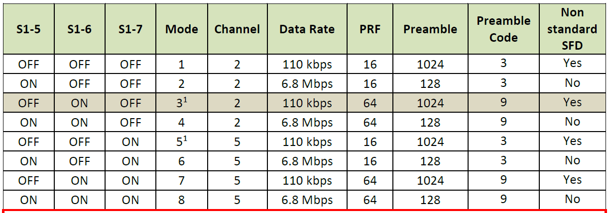

# Decawave Ranging and data transfer 1.0

The EVK1000 provides all HW and SW elements to perform a Two-Way Ranging evaluation, including: Range accuracy, Range precision, Range sensitivity, Multipath immunity, Blocking immunity and much more. [EVK1000](https://www.decawave.com/product/evk1000-evaluation-kit/)

# Requirements

* AC6 SystemWorkbench [Here](https://www.st.com/en/development-tools/sw4stm32.html)
* STM32CubeMx [Here](https://www.st.com/en/development-tools/stm32cubemx.html)
* MATLAB
* TeraTerm [Here](https://ttssh2.osdn.jp/index.html.en)

Firmware for the custom board Sensor Node - SynthSense Project - Hardware Repository [Here](https://github.com/yqinic/sensor_node)

## Installation

This chart shows the latest firmware that were available and are supported at the time of 3.7 release.

| Aircraft/FC       | Firmware Package Version | Custom Controller Version | STM API           | Notes                                                                 |
|-------------------|--------------------------|---------------------------|------------------------|-----------------------------------------------------------------------|
| **STM32F105**     | **3.11**                 | **0.0**                   | **HAL CUBE MX**        |                                                                       |
   

## Usage example

* 1: Program the EVK1000 in MODE3 as a TAG

* 2: Connect the EVK1000 with the USB Cable (baudrate: 115200)
* 3: On teraterm typing and return
```sh
S
```
* 4: The ranging protocol starts
* 5: Trigger the data transfer typing:
```sh
E
```
* 5: After the transfer the EVK1000 will reboot sending
```sh
N
```

### Automatic Mode - Audio

Using this script the ranging protocol and the data transfer will be automatically triggered. Moreover, this file includes the data conversion
between the raw bitstream and the audio file.

```sh
Serial_DwnlDataFromSensorNode.m
```

Imported files:
```sh
Audio_16-Dec-2019 15_48_17.dat
Audio_16-Dec-2019 15_48_46.mat
```

### Automatic Mode - Internal Sensors

Using this script the ranging protocol and the data transfer will be automatically triggered. Moreover, this file includes the data conversion
between the raw bitstream and the sensor struct.

```sh
Serial_Dwnl_INTERNALSENSORS_FromSensorNode.m
```

Imported files:
```sh
Int_Sens_16-Dec-2019 15_20_12.mat
Int_Sens_16-Dec-2019 15_20_12.csv
Int_Sens_16-Dec-2019 15_20_04.dat
```

## Development setup

### Macros

* IoT_MODE (instance.h): If enabled allows the high-speed and bidirectional data transfer commands
* COMBO_UWB_POWERTRANSF(instance.h): If enabled inserts the power transfer coil voltage into the ranging packet, only one direction  ANCHOR --> TAG

## Release History

* 0.1.1
    * Power transfer coil voltage while ranging
* 0.1.0
    * The first proper release UWB
* 0.0.1
    * Work in progress

## Meta

Tommaso Polonelli – t.polonelli19@imperial.ac.uk

Distributed under the XYZ license. See ``LICENSE`` for more information.
